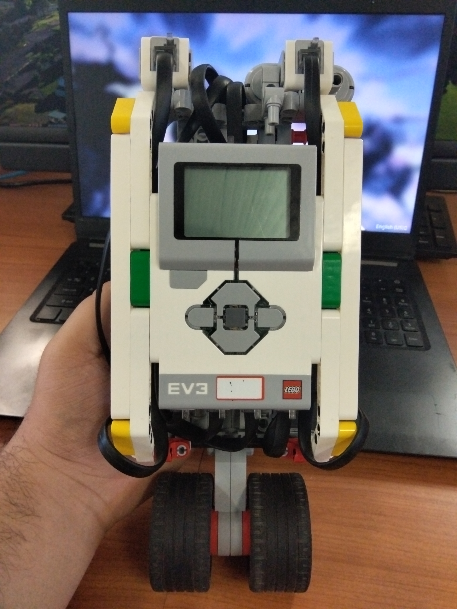
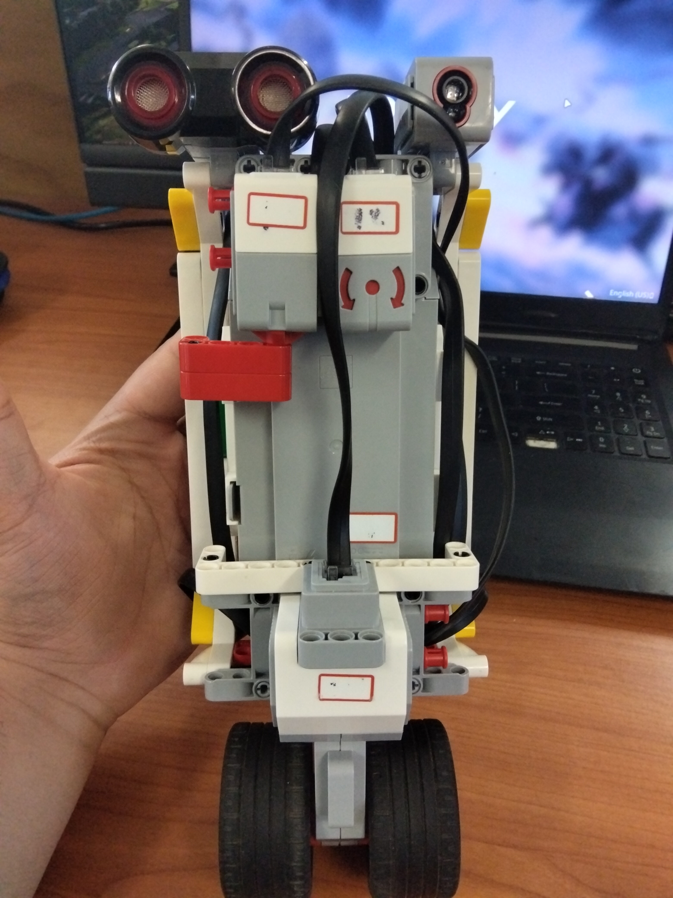
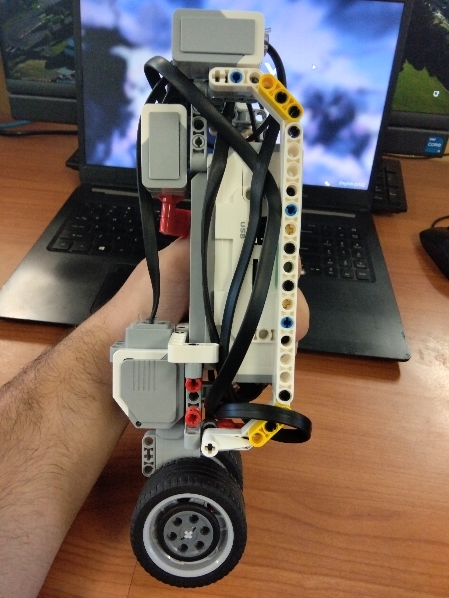
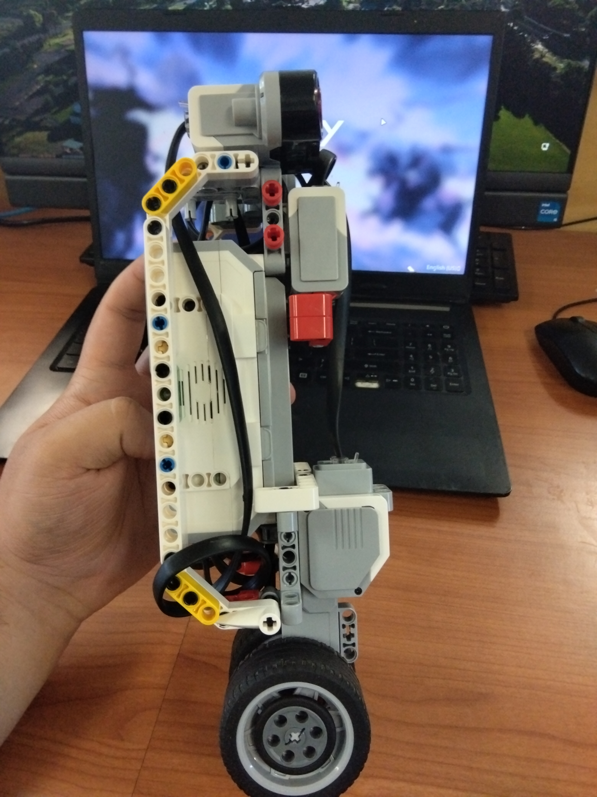
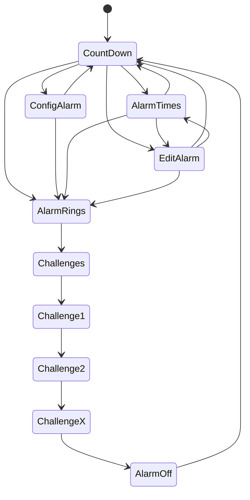

# RoboAlarm
## Table of Contents
- [RoboAlarm](#roboalarm)
	- [Table of Contents](#table-of-contents)
	- [Preplanning](#preplanning)
		- [Overview](#overview)
		- [Setting the Alarm](#setting-the-alarm)
			- [Editing Alarm](#editing-alarm)
			- [Setting Multiple Alarms](#setting-multiple-alarms)
			- [Multiple Views](#multiple-views)
		- [Challenges](#challenges)
			- [Setting Challenges](#setting-challenges)
			- [0 - LED Memory Game](#0---led-memory-game)
			- [1 - Motor Control Test](#1---motor-control-test)
			- [2 - Colour Recognition](#2---colour-recognition)
			- [3 - Distance Challenge](#3---distance-challenge)
			- [4. Gyro Coordination Test](#4-gyro-coordination-test)
		- [Robot Design](#robot-design)
			- [Front View](#front-view)
			- [Back View](#back-view)
			- [Side View](#side-view)
			- [Eugonomics and Usability](#eugonomics-and-usability)
		- [Development Plan](#development-plan)
			- [Development Flowchart](#development-flowchart)
			- [User Flowchart](#user-flowchart)
			- [Pseudocode Code](#pseudocode-code)
	- [Development](#development)
		- [Prototype 0: Setting and Editing the Alarm](#prototype-0-setting-and-editing-the-alarm)
			- [Discussion](#discussion)
			- [Code Snippets](#code-snippets)
			- [Video of Functionality](#video-of-functionality)
			- [Video of Non-Developer Use](#video-of-non-developer-use)
			- [Issues and Solutions](#issues-and-solutions)
		- [Prototype 1: Multiple views and Multiple Alarms](#prototype-1-multiple-views-and-multiple-alarms)
			- [Discussion](#discussion-1)
			- [Code Snippets](#code-snippets-1)
			- [Video of Functionality](#video-of-functionality-1)
			- [Video of Non-Developer Use](#video-of-non-developer-use-1)
			- [Issues and Solutions](#issues-and-solutions-1)
		- [Prototype 2: Randomising based on Challenge Level, LED Challenge](#prototype-2-randomising-based-on-challenge-level-led-challenge)
			- [Discussion](#discussion-2)
			- [Code Snippets](#code-snippets-2)
			- [Video of Functionality](#video-of-functionality-2)
			- [Video of Non-Developer Use](#video-of-non-developer-use-2)
			- [Issues and Solutions](#issues-and-solutions-2)
		- [Prototype 3: Motor and Ultrasonic Sensor Challenges](#prototype-3-motor-and-ultrasonic-sensor-challenges)
			- [Discussion](#discussion-3)
			- [Code Snippets](#code-snippets-3)
			- [Video of Functionality](#video-of-functionality-3)
			- [Video of Non-Developer Use](#video-of-non-developer-use-3)
			- [Issues and Solutions](#issues-and-solutions-3)
		- [Prototype 4: Colour and Gyro Sensor Challenges](#prototype-4-colour-and-gyro-sensor-challenges)
			- [Discussion](#discussion-4)
			- [Code Snippets](#code-snippets-4)
			- [Video of Functionality](#video-of-functionality-4)
			- [Video of Non-Developer Use](#video-of-non-developer-use-4)
			- [Issues and Solutions](#issues-and-solutions-4)
	- [Final Design and Capabilities](#final-design-and-capabilities)
		- [Features](#features)
		- [System Architecture](#system-architecture)
		- [Final Testing](#final-testing)
		- [Final Robot Design](#final-robot-design)
		- [Video of Full Use and Capabilities](#video-of-full-use-and-capabilities)
		- [Video of Use from a non-Developer](#video-of-use-from-a-non-developer)
	- [Reflection](#reflection)
		- [What do you think of the overall design?](#what-do-you-think-of-the-overall-design)
		- [What changes would you make?](#what-changes-would-you-make)
		- [What issues did you experience?](#what-issues-did-you-experience)
		- [What techniques did you use to solve these issues?](#what-techniques-did-you-use-to-solve-these-issues)
		- [What changes would you make if repeating this project?](#what-changes-would-you-make-if-repeating-this-project)
		- [What have you learnt from the project?](#what-have-you-learnt-from-the-project)
	- [Sources](#sources)
		- [Code References](#code-references)
		- [Hardware Documentation](#hardware-documentation)
		- [Tutorials or Guides Used](#tutorials-or-guides-used)

## Preplanning
### Overview
Many people rely on alarms to wake up in the morning, but normal alarms are often easy to ignore. It is common for people to turn the alarm off or hit snooze and go back to sleep, which can cause them to miss classes, work, or other important events.

To help solve this problem I designed RoboAlarm, a robotic alarm system that actively helps the user wake up. The device allows the user to set alarms, choose from a range of alarm sounds, and select how much help they need waking up. Instead of simply turning the alarm off, the user must complete a number of small challenges before the alarm will stop. These challenges require physical or mental interaction with the robot, making it much harder for the user to fall back asleep.

### Setting the Alarm
When setting the alarm the system will first determine the current time. This may be retrieved automatically if the CPU has access to a real time clock. If this is not available the time will need to be entered manually.

After the current time is known the user will select when the alarm should go off. This can either be a specific time or a duration until the alarm activates. Once the time has been chosen the user will then select an alarm sound and how much help they need to wake up.

#### Editing Alarm
Existing alarms can also be edited. The user will be able to change the time the alarm goes off, the alarm sound, and how many challenges are required to turn the alarm off.

#### Setting Multiple Alarms
The system will support multiple alarms. Each alarm can be set to activate at a different time.

If a new alarm goes off while another alarm is still active, the system will add extra challenges to the current alarm rather than starting a completely new one. This prevents the user from avoiding alarms by delaying challenges.

#### Multiple Views
The device will have multiple views to make it easier to manage alarms.

The main view will show a large countdown timer for the closest upcoming alarm. It will also display a list of other alarms below it. Selecting an alarm will allow the user to edit its settings.

The second view will display the current time and a list of all alarms with their scheduled times.

The third view will be the alarm creation screen where the user can create and configure new alarms.

### Challenges
The challenge system is designed to stop the user from simply turning the alarm off and going back to sleep. The alarm will only stop once the required number of challenges have been completed.

When the alarm activates, a challenge will be randomly selected from a set of available tasks. After the user completes one challenge another will be selected until the required number has been completed.

#### Setting Challenges
When creating the alarm the user chooses how much help they need waking up.

| Setting | # of Challenges |
| ------- | --------------- |
| Some | 3 |
| More | 4 |
| Most | 5 |

#### 0 - LED Memory Game
A sequence of LEDs will flash in a certain order before turning off. The user must reproduce the same sequence in order to continue.

#### 1 - Motor Control Test
The display will show a target speed range along with the current speed. The user must spin the motor and keep it within the acceptable speed range for several seconds.

#### 2 - Colour Recognition
The display will ask the user to present a specific colour. The user must show an object with that colour to the colour sensor and then press the push sensor on the back of the device to confirm.

If the user cannot find the required colour they must first wait ten seconds before pressing a button to generate a new colour.

#### 3 - Distance Challenge
The display will show a target distance along with the current distance being measured. The user must move the device until the measured distance is within the acceptable range, then press the push sensor to confirm.

#### 4. Gyro Coordination Test
The display will show the current angle of the device and a target angle. The user must rotate the device until the angle matches the target range.

Once the correct angle is reached the user must answer two or three questions while keeping the device within that angle range.

### Robot Design
After planning the features of the RoboAlarm I constructed a prototype robot that could support the required sensors and interactions. This design represents the initial layout of the device.

The design may change during development as new issues or improvements are discovered. Any changes made later will be recorded in the development section of the project.

#### Front View



#### Back View



#### Side View





#### Eugonomics and Usability
Part of the design focused on making the device easy to interact with.

The ultrasonic and colour sensors are mounted on the front of the device so the user can easily point them at a wall or coloured object when completing challenges.

Behind these sensors is the gyro sensor, which is positioned to detect rotational movement when the device is turned.

The touch sensor is mounted at the back of the device facing the user. It is fitted with a button style design similar to those found on controllers so it is easy to press when confirming actions.

Finally the motor is mounted near the base of the device where it can easily be spun during the motor challenge.

### Development Plan

#### Development Flowchart

![[mermaid-diagram-2026-03-12-121152.png|697]]
#### User Flowchart



#### Pseudocode Code

```pseudocode
Import all libraries

Initialise robot outputs
Initialise sensors

Enum State
	idle
	setting
	editing
	challenges
	
Enum Challenges
	led_memory_game
	motor_control_test
	colour_recognition
	distance_challange
	gyro_coordination

Class Alarm
	Init
		siren
		target_time
		challenge_amount
		
	Ring
		play alarm sound
		start vibration
		
Class Challenge
	Init
		type = Challenges.random
	
	Run
		if type = led_memory_game
			run LED memory sequence
			get user button input
			check sequence
			
		if type = motor_control_test
			generate target speed range
			read motor speed
			check speed for a few sseconds
			
		if type = colour_recognition
			generate random colour
			wait for press 
			read colour sensor
			
		if distance_challenge
			generate target distance
			read distance
			press confirm when in range
			
		if type = gyro_coordination
			generate target angle
			read gyro sensor
			ask questions while hold at angle
	
Class AlarmRobot
	Init
		state = idle
		alarms = empty list
		current_time = system time
		
		initialise sensors
		initialise motors
		inisialise outputs
		
	set_alarm
		create new Alarm
		
		ask user for alarm sound
		store sound
		
		ask user for challenge level
			some = 3
			more = 4
			most = 5
		
		ask user for target time or duration until alarm 
		
		add alarm to alarm list
		
	edit_alarm
		display list of alarms
		user selects alarm
		
		allow editing of 
			time
			sound 
			challenge amount
			
	check_alarms
		for each alarm in alarms
			if current_time >= alarm.target_time
				return alarm
				
		return none
			
	run_challenges
		completed = 0
		required = alarm.challenge_amount
		
		while completed < required
			challenge = new challenge
			challenge.Run()
			
			if success
				completed += 1
				
		stop alarm sound
		retunr to idle

alarm = AlarmRobot

Loop

	update current time could be thread
	
	if alarm.state = idle
		check larms
		if alarm triggered
			alarm.Ring() as thread
			alarm.state = challenges
			
	if alarm.state = setting
		alarm.Set_alarm()
		alarm.state = idle
		
	if alarm.state = editing 
		alarm.Edit_alarm()
		alarm.state = idle
		
	if alarm.state = challenges
		alarm.run_challenges()
		
	wait short time 

```
## Development

### Prototype 0: Setting and Editing the Alarm

#### Discussion

#### Code Snippets
**State System**
```python
class State(Enum):  
	IDLE = 0  
	SETTING = 1  
	EDITING = 2  
	CHALLENGE = 3  
	VIEW = 4
```
This sets up the main states of the program, and is used to tell the robot whether it should, be in a menu, editing alarms, or running challenges.

**Main Menu**
```python
def main_menu(self):
    selector = 0

    while self.state == state.IDLE:
        self.clear_screen()
        self.lcd.text_pixels("== RoboAlarm ==", clear_screen=False, x=10, y=20, text_color='black')

        y_pos = 30
        i = 0

        while i < len(self.menu_items):
            text = self.menu_items[i]

            if i == selector:
                text = ">> " + text
            else:
                text = "   " + text

            self.lcd.text_pixels(text,clear_screen=False, x=10, y=y_pos, text_color='black')

            y_pos += 15
            i += 1
        
        self.lcd.update()

        if self.btn.up:
            selector -= 1
            if selector < 0:
                selector = len(self.menu_items) - 1

        if self.btn.down:
            selector += 1
            if selector > len(self.menu_items):
                selector = 0 

        if self.btn.enter:
            self.change_state(selection=selector)

        time.sleep(0.05)
```
This is the first section of UI, it allows the user to move through the menu and into the other sub menus. The base navigation is later used again for most individual menus. 

**Alarm Editor**
```python
def alarm_editor(self, existing_alarm=None):
    siren_names = list(SIRENS.keys())

    if existing_alarm is None:
        hour = 7
        minute = 0
        siren_index = 0
        challenge_amount = 1
        title = "== Set Alarm =="
    else:
        hour_str, minute_str = existing_alarm.target_time.split(":")
        hour = int(hour_str)
        minute = int(minute_str)

        siren_index = siren_names.index(existing_alarm.siren)

        challenge_amount = existing_alarm.challenge_amount
        title = "== Edit Alarm =="

    fields = ["Hour", "Minute", "Siren", "Challenges", "Save", "Cancel"]
    selector = 0
```
This 

**Save Alarm**
```python
elif self.btn.enter:
    if selector == 4:
        alarm_time = f"{hour:02}:{minute:02}"
        siren = siren_names[siren_index]
        if existing_alarm is not None:
            self.alarms.remove(existing_alarm)
        new_alarm = Alarm(alarm_time, siren, challenge_amount)
        self.alarms.append(new_alarm)

        self.clear_screen()
        self.lcd.text_pixels("Alarm Added!", clear_screen=False, x=10, y=20, text_color='black')
        self.lcd.text_pixels(new_alarm.alarm_description(), clear_screen=False, x=10, y=40, text_color='black')
        self.lcd.update()

        self.sound.beep()
        time.sleep(1)
        self.state = State.IDLE

    elif selector == 5:
        self.state = State.IDLE

    time.sleep(0.05)
```

#### Video of Functionality

#### Video of Non-Developer Use

#### Issues and Solutions

### Prototype 1: Multiple views and Multiple Alarms

#### Discussion

#### Code Snippets

**Updated Menu Options for multiple views**
```python

```

**Main Menu handling New views**
```python

```

**Editing from a list of multiple alarms**
```python

```

**Viewing all alarms**
```python

```
#### Video of Functionality

#### Video of Non-Developer Use

#### Issues and Solutions

### Prototype 2: Randomising based on Challenge Level, LED Challenge

#### Discussion

#### Code Snippets

#### Video of Functionality

#### Video of Non-Developer Use

#### Issues and Solutions

### Prototype 3: Motor and Ultrasonic Sensor Challenges

#### Discussion

#### Code Snippets

#### Video of Functionality

#### Video of Non-Developer Use

#### Issues and Solutions

### Prototype 4: Colour and Gyro Sensor Challenges

#### Discussion

#### Code Snippets

#### Video of Functionality

#### Video of Non-Developer Use

#### Issues and Solutions

## Final Design and Capabilities

### Features

### System Architecture

### Final Testing

### Final Robot Design

### Video of Full Use and Capabilities

### Video of Use from a non-Developer

## Reflection

### What do you think of the overall design?

### What changes would you make?

### What issues did you experience?

### What techniques did you use to solve these issues?

### What changes would you make if repeating this project?

### What have you learnt from the project?

## Sources

### Code References

### Hardware Documentation

### Tutorials or Guides Used
