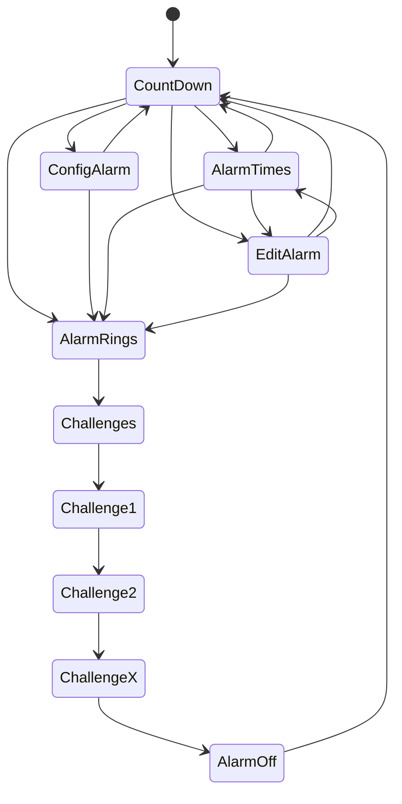

# RoboAlarm
<center>Dexter Hart</center>

## Table of Contents
- [Table of Contents](#table-of-contents) <span style="float:right;">Pg.01</span>

- [Testing Notice](#testing-notice) <span style="float:right;">Pg.03</span>

- [Preplanning](#preplanning) <span style="float:right;">Pg.03</span>
	- [Overview](#overview) <span style="float:right;">Pg.03</span>
	- [Setting the Alarm](#setting-the-alarm)<span style="float:right;">Pg.03</span>
		- [Editing Alarm](#editing-alarm)<span style="float:right;">Pg.04</span>
		- [Setting Multiple Alarms](#setting-multiple-alarms)<span style="float:right;">Pg.04</span>
		- [Multiple Views](#multiple-views)<span style="float:right;">Pg.04</span>
	- [Challenges](#challenges)<span style="float:right;">Pg.04</span>
		- [Setting Challenges](#setting-challenges)<span style="float:right;">Pg.04</span>
		- [0 - LED Memory Game](#0---led-memory-game)<span style="float:right;">Pg.05</span>
		- [1 - Motor Control Test](#1---motor-control-test)<span style="float:right;">Pg.05</span>
		- [2 - Colour Recognition](#2---colour-recognition)<span style="float:right;">Pg.05</span>
		- [3 - Distance Challenge](#3---distance-challenge)<span style="float:right;">Pg.05</span>
		- [4 - Gyro Coordination Test](#4-gyro-coordination-test)<span style="float:right;">Pg.06</span>
	- [Robot Design](#robot-design)<span style="float:right;">Pg.06</span>
		- [Front View](#front-view)<span style="float:right;">Pg.07</span>
		- [Back View](#back-view)<span style="float:right;">Pg.08</span>
		- [Side View](#side-view)<span style="float:right;">Pg.09</span>
		- [Ergonomics and Usability](#ergonomics-and-usability)<span style="float:right;">Pg.14</span>
	- [Development Plan](#development-plan)<span style="float:right;">Pg.14</span>
		- [Development Flowchart](#development-flowchart)<span style="float:right;">Pg.14</span>
		- [User Flowchart](#user-flowchart)<span style="float:right;">Pg.15</span>
		- [Pseudocode Code](#pseudocode-code)<span style="float:right;">Pg.16</span>

- [Development](#development)<span style="float:right;">Pg.19</span>
	- [Prototype 0: Setting and Editing the Alarm](#prototype-0-setting-and-editing-the-alarm)<span style="float:right;">Pg.19</span>
		- [Discussion<span style="float:right;">Pg.19</span>](#discussion)
		- [Code Snippets](#code-snippets)<span style="float:right;">Pg.19</span>
		- [Video of Functionality](#video-of-functionality)<span style="float:right;">Pg.23</span>
	- [Prototype 1: Multiple views and Multiple Alarms](#prototype-1-multiple-views-and-multiple-alarms)<span style="float:right;">Pg.24</span>
		- [Discussion](#discussion-1)<span style="float:right;">Pg.24</span>
		- [Code Snippets](#code-snippets-1)<span style="float:right;">Pg.24</span>
		- [Video of Functionality](#video-of-functionality-1)<span style="float:right;">Pg.26</span>
	- [Prototype 2: Alarm Countdown, Ring, and Randomising based on Challenge Level](#prototype-2-alarm-countdown-ring-and-randomising-based-on-challenge-level)<span style="float:right;">Pg.27</span>
		- [Discussion](#discussion-2)<span style="float:right;">Pg.27</span>
		- [Code Snippets](#code-snippets-2)<span style="float:right;">Pg.27</span>
		- [Video of Functionality](#video-of-functionality-2)<span style="float:right;">Pg.29</span>
	- [Prototype 3: LED and, Motor Challenges](#prototype-3-led-and-motor-challenges)<span style="float:right;">Pg.30</span>
		- [Discussion<span style="float:right;">Pg.30</span>](#discussion-3)
		- [Code Snippets](#code-snippets-3)<span style="float:right;">Pg.30</span>
		- [Video of Functionality](#video-of-functionality-3)<span style="float:right;">Pg.31</span>
	- [Prototype 4: Colour, Gyro and Ultrasonic Challenges](#prototype-4-colour-gyro-and-ultrasonic-challenges) <span style="float:right;">Pg.32</span>
		- [Discussion](#discussion-4)<span style="float:right;">Pg.32</span>
		- [Code Snippets](#code-snippets-4)<span style="float:right;">Pg.32</span>
		- [Video of Functionality](#video-of-functionality-4)<span style="float:right;">Pg.33</span>
	- [Prototype 5: Fixing issue detected by user testing](#prototype-5-fixing-issue-detected-by-user-testing)<span style="float:right;">Pg.34</span>
		- [User Feedback](#user-feedback)<span style="float:right;">Pg.34</span>
		- [Code Snippets](#code-snippets-5)<span style="float:right;">Pg.34</span>

- [Issues and Solutions](#issues-and-solutions)<span style="float:right;">Pg.38</span>

- [Final Design and Capabilities](#final-design-and-capabilities)<span style="float:right;">Pg.40</span>
	- [Features](#features)<span style="float:right;">Pg.40</span>
	- [Final Robot Design](#final-robot-design)<span style="float:right;">Pg.40</span>
	- [Video of Full Use and Capabilities](#video-of-full-use-and-capabilities) <span style="float:right;">Pg.40</span>

- [Reflection](#reflection)<span style="float:right;">Pg.41</span>
	- [What do you think of the overall design?](#what-do-you-think-of-the-overall-design)<span style="float:right;">Pg.41</span>
	- [What changes would you make?](#what-changes-would-you-make)<span style="float:right;">Pg.41</span>
	- [What issues did you experience?](#what-issues-did-you-experience)<span style="float:right;">Pg.41</span>
	- [What Changes would you make if Repeating this project]()<span style="float:right;">Pg.42</span>
	- [What have you learnt from the project?]()<span style="float:right;">Pg.42</span>
	
- [Appendix](#appendix) <span style="float:right;">Pg.43</span>
	- [1 - User Feedback Research Consent Form](#1---user-feedback-research-consent-form)<span style="float:right;">Pg.43</span>

<div style="page-break-after: always;"></div>

## Testing Notice

Hi Tim, just wanted to let you know that for testing I have made a way to turn on and off the fast countdown in the main menu while running, to do so hold down the touch sensor for five seconds, release the touch sensor, then the robot will beep two times. After this all countdowns will run at 60 times speed. Note it will need to finish the prior minute before changing to these faster speeds.

## Preplanning
### Overview
Many people rely on alarms to wake up in the morning, but some normal alarms are often easy to ignore. Because of this it is common for people to turn their alarms off or hit snooze to go back to sleep, which can cause them to miss classes, work, or other important events.

To help solve this problem I designed this RoboAlarm, a robotic alarm system that tries to actively helps the user wake up. The device allows the user to set alarms, choose from a range of alarm sounds, and select how much help they need waking up. Instead of simply turning the alarm off, the user must complete a number of small challenges before the alarm will stop. These challenges require physical or mental interaction with the robot, making it much harder for the user to fall back asleep.

### Setting the Alarm
When setting the alarm the system will first determine the current time. This may be retrieved automatically if the CPU has access to a real time clock. If this is not available the time will need to be entered manually.

After the current time is known the user will select when the alarm should go off. This can either be a specific time or a duration until the alarm activates. Once the time has been chosen the user will then select an alarm sound and how much help they need to wake up.

#### Editing Alarm
Existing alarms can also be edited. The user will be able to change the time the alarm goes off, the alarm sound, and how many challenges are required to turn the alarm off.

#### Setting Multiple Alarms
The system will support multiple alarms. Each alarm can be set to activate at a different time.

If a new alarm goes off while another alarm is still active, the system will add extra challenges to the current alarm rather than starting a completely new one. This prevents the user from avoiding alarms by delaying challenges.

#### Multiple Views
The device will have multiple views to make it easier to manage alarms.

The main view will show a large countdown timer for the closest upcoming alarm. It will also display a list of other alarms below it. Selecting an alarm will allow the user to edit its settings.

The second view will display the current time and a list of all alarms with their scheduled times.

The third view will be the alarm creation screen where the user can create and configure new alarms.

### Challenges
The challenge system is designed to stop the user from simply turning the alarm off and going back to sleep. The alarm will only stop once the required number of challenges have been completed.

When the alarm activates, a challenge will be randomly selected from a set of available tasks. After the user completes one challenge another will be selected until the required number has been completed.

#### Setting Challenges
When creating the alarm the user chooses how much help they need waking up.

| Setting | # of Challenges |
| ------- | --------------- |
| Some | 3 |
| More | 4 |
| Most | 5 |

#### 0 - LED Memory Game
A sequence of LEDs will flash in a certain order before turning off. The user must reproduce the same sequence in order to continue.

#### 1 - Motor Control Test
The display will show a target speed range along with the current speed. The user must spin the motor and keep it within the acceptable speed range for several seconds.

#### 2 - Colour Recognition
The display will ask the user to present a specific colour. The user must show an object with that colour to the colour sensor and then press the push sensor on the back of the device to confirm.

If the user cannot find the required colour they must first wait ten seconds before pressing a button to generate a new colour.

#### 3 - Distance Challenge
The display will show a target distance along with the current distance being measured. The user must move the device until the measured distance is within the acceptable range, then press the push sensor to confirm.

#### 4. Gyro Coordination Test
The display will show the current angle of the device and a target angle. The user must rotate the device until the angle matches the target range.

Once the correct angle is reached the user must answer two or three questions while keeping the device within that angle range.

### Robot Design
After planning the features of the RoboAlarm I constructed a prototype robot that could support the required sensors and interactions. This design represents the initial layout of the device.

The design may change during development as new issues or improvements are discovered. Any changes made later will be recorded in the development section of the project.

<div style="page-break-after: always;"></div>

#### Front View


<div style="page-break-after: always;"></div>

#### Back View


<div style="page-break-after: always;"></div>

#### Side View


<div style="page-break-after: always;"></div>


<div style="page-break-after: always;"></div>

#### Ergonomics and Usability
Part of the design focused on making the device easy to interact with.

The ultrasonic and colour sensors are mounted on the front of the device so the user can easily point them at a wall or coloured object when completing challenges.

Behind these sensors is the gyro sensor, which is positioned to detect rotational movement when the device is turned.

The touch sensor is mounted at the back of the device facing the user. It is fitted with a button style design similar to those found on controllers so it is easy to press when confirming actions.

Finally the motor is mounted near the base of the device where it can easily be spun during the motor challenge.

### Development Plan

#### Development Flowchart

Below is the planned flowchart for development. 

![[mermaid-diagram-2026-03-12-121152.png|697]]
#### User Flowchart

Here is the planned user flow.


#### Pseudocode Code

```pseudocode
Import all libraries

Initialise robot outputs
Initialise sensors

Enum State
	idle
	setting
	editing
	challenges
	
Enum Challenges
	led_memory_game
	motor_control_test
	colour_recognition
	distance_challange
	gyro_coordination

Class Alarm
	Init
		siren
		target_time
		challenge_amount
		
	Ring
		play alarm sound
		start vibration
		
Class Challenge
	Init
		type = Challenges.random
	
	Run
		if type = led_memory_game
			run LED memory sequence
			get user button input
			check sequence
			
		if type = motor_control_test
			generate target speed range
			read motor speed
			check speed for a few sseconds
			
		if type = colour_recognition
			generate random colour
			wait for press 
			read colour sensor
			
		if distance_challenge
			generate target distance
			read distance
			press confirm when in range
			
		if type = gyro_coordination
			generate target angle
			read gyro sensor
			ask questions while hold at angle
	
Class AlarmRobot
	Init
		state = idle
		alarms = empty list
		current_time = system time
		
		initialise sensors
		initialise motors
		inisialise outputs
		
	set_alarm
		create new Alarm
		
		ask user for alarm sound
		store sound
		
		ask user for challenge level
			some = 3
			more = 4
			most = 5
		
		ask user for target time or duration until alarm 
		
		add alarm to alarm list
		
	edit_alarm
		display list of alarms
		user selects alarm
		
		allow editing of 
			time
			sound 
			challenge amount
			
	check_alarms
		for each alarm in alarms
			if current_time >= alarm.target_time
				return alarm
				
		return none
			
	run_challenges
		completed = 0
		required = alarm.challenge_amount
		
		while completed < required
			challenge = new challenge
			challenge.Run()
			
			if success
				completed += 1
				
		stop alarm sound
		retunr to idle

alarm = AlarmRobot

Loop

	update current time could be thread
	
	if alarm.state = idle
		check larms
		if alarm triggered
			alarm.Ring() as thread
			alarm.state = challenges
			
	if alarm.state = setting
		alarm.Set_alarm()
		alarm.state = idle
		
	if alarm.state = editing 
		alarm.Edit_alarm()
		alarm.state = idle
		
	if alarm.state = challenges
		alarm.run_challenges()
		
	wait short time 

```

<div style="page-break-after: always;"></div>

## Development
### Prototype 0: Setting and Editing the Alarm
#### Discussion
During this stage I focused on making the base of the `Alarm` class, and the `AlarmBot` class. After that I made the systems to create an alarm as well as edit them. The interface from this was later used as the base for future menus. 
#### Code Snippets

**Alarm Class**
``` Python
class Alarm():
	def __init__(self, owner, target_time, siren, challenge_amount):
		self.owner = owner
		self.sound = Sound()
		self.siren = siren
		self.target_time = target_time
		self.challenge_amount = challenge_amount
		
		self.target_hour, self.target_minute = self.target_time.split(":")
		self.target_hour = int(self.target_hour)
		self.target_minute = int(self.target_minute)	  
	
	def alarm_description(self):
		return " {} | {} | {} Challenges".format(self.target_time, self.siren, self.challenge_amount)
```
This class stores all data related to a single alarm and converts the time into usable values, for the countdown system I will develop later. The `alarm_description` method formats the alarm into a readable string so it can be displayed in menus.

**Alarm Editor Navigation**
``` Python
fields = ["Hour", "Minute", "Siren", "Challenges", "Save", "Cancel"]
selector = 0

while True:
	while i < len(fields):
		label = fields[i]
		
		if label == "Hour":
			value = "{}".format(hour)
		elif label == "Minute":
			value = "{}".format(minute)
		elif label == "Siren":
			value = siren_names[siren_index]
		elif label == "Challenges":
			value = str(challenge_amount)
		else:
			value = ""
		
		if i == selector:
			prefix = ">> "
		else:
			prefix = " "
			
# Parts removed for readability

	if self.btn.up:
		selector -= 1
		if selector < 0:
			selector = len(fields) - 1
		time.sleep(0.05)
	
	elif self.btn.down:
		selector += 1
		if selector >= len(fields):	
			selector = 0
		time.sleep(0.05)
```
This section shows the selectable UI for setting the alarm, it iterates through each field and displays its current value. If you have selected that field it prefix's with the following `">>"`. This allows the user to move through the alarm editor and modify the selected values.

**Allowing for both Initial setup and Editing** 
``` Python
if existing_alarm is None:
	hour = 7
	minute = 0
	siren_index = 0
	challenge_amount = 1
	title = "== Set Alarm =="

else:
	self.state = State.SETTING
	hour_str, minute_str = existing_alarm.target_time.split(":")
	hour = int(hour_str)
	minute = int(minute_str)
	siren_index = siren_names.index(existing_alarm.siren)
	challenge_amount = existing_alarm.challenge_amount
	title = "== Edit Alarm =="
	
# AFTER EDITING 
elif self.btn.enter:
	if selector == 4:
		alarm_time = "{}:{}".format(hour,minute)
		siren = siren_names[siren_index]
		if existing_alarm is not None:
			self.alarms.remove(existing_alarm)
		new_alarm = Alarm(self,alarm_time, siren, challenge_amount)
		self.alarms.append(new_alarm)
		
		self.clear_screen()
		self.lcd.text_pixels("Alarm Added", clear_screen=False, x=10, y=20, text_color='black')
		self.lcd.text_pixels(new_alarm.alarm_description(), clear_screen=False, x=10, y=40, text_color='black')
		self.lcd.update()
		
		self.sound.beep()
		time.sleep(1)
		self.state = State.IDLE


```
This allows for the same editor function to be reused for both creating and editing the alarms, by either loading the default or getting the current value of the existing alarms. Then when saving it replaces or creates a new alarm. 

**Changing Alarm Values**
``` Python
elif self.btn.left:
	if selector == 0:
		hour -= 1
		if hour < 0:
			hour = 23
			
	elif selector == 1:
		minute -= 1
		if minute < 0:
			minute = 59
			
	elif selector == 2:
		siren_index -= 1
		if siren_index < 0:
			siren_index = len(siren_names) - 1
			
	elif selector == 3:
		challenge_amount -= 1
			if challenge_amount < 1:
				challenge_amount = 1
	time.sleep(0.05)

elif self.btn.right:
	if selector == 0:
		hour += 1
		if hour > 23:
			hour = 0
			
	elif selector == 1:
		minute += 1
		if minute > 59:
			minute = 0
			
	elif selector == 2:
		siren_index += 1
		if siren_index >= len(siren_names):
			siren_index = 0
			
	elif selector == 3:
		challenge_amount += 1
		if challenge_amount > 10:
			challenge_amount = 10
	time.sleep(0.05)

```
This is the system I used to modify the values, it uses the left and right buttons to either increase of decrease the selected value. If needed it wraps around the value to keep them within the available range. 
#### Video of Functionality

Please see the `Videos` folder, `Setting Alarm.mp4`, and `Editing alarm.mp4`.

<div style="page-break-after: always;"></div>


### Prototype 1: Multiple views and Multiple Alarms

#### Discussion
During this stage I developed the state system, which allows the user to navigate through the menus, and also if need be in the future is expandable for more menus. This stage also added in a way to view all the set alarms. It also reused the navigation logic developed in prototype 0. 
#### Code Snippets

**State Enum**
``` Python
class State(Enum):
	IDLE = 0
	SETTING = 1
	EDITING = 2
	CHALLENGE = 3
	VIEW = 4
```
Here I define the state enums, which allows the program to change between the different states.

**View Switching**
``` Python
alarm_bot = AlarmBot()
# Alarm initialises with state = State.IDLE

while True:
	if alarm_bot.state == State.IDLE:
		alarm_bot.main_menu()
	
	elif alarm_bot.state == State.SETTING:
		alarm_bot.alarm_editor()
	
	elif alarm_bot.state == State.EDITING:
		alarm_bot.edit_alarm()
	
	elif alarm_bot.state == State.VIEW:
		alarm_bot.view_alarms()
	
	elif alarm.state == State.CHALLENGE:
		alarm_bot.challenge_active()
	
	time.sleep(.2)
```
This main loop checks the current state and calls the corresponding function. Inside each function is also a while loop which will break when they are no longer the correct state.

**Navigating Main Menu**
``` Python
selector = 0

while self.state == State.IDLE:
	self.clear_screen()
	self.lcd.text_pixels("== RoboAlarm ==", clear_screen=False, x=10, y=20, text_color='black')
	
	y_pos = 30
	i = 0
	
	while i < len(self.menu_items):
		text = self.menu_items[i]
		
		if i == selector:
			text = ">> " + text
		else:
			text = " " + text
		
		self.lcd.text_pixels(text,clear_screen=False, x=10, y=y_pos, text_color='black')
		
		y_pos += 15
		i += 1
	self.lcd.update()
	
	if self.btn.up:
		selector -= 1
	if selector < 0:
		selector = len(self.menu_items) - 1

	if self.btn.down:
		selector += 1
	if selector > len(self.menu_items):
		selector = 0
	
	if self.btn.enter:
		self.change_state(selection=selector)
	
	time.sleep(0.05)
```
This code renders the main menu and updates the selector based on button input, allowing the user to move through options and select a new state.

**View Alarms**
``` Python
def view_alarms(self):
	while self.state == State.VIEW:
		self.clear_screen()
		self.lcd.text_pixels("Alarms", 10, 10) 
		
		y_pos = 40
		i = 0  
		
		while i < len(self.alarms):
			alarm = self.alarms[i]
			self.lcd.text_pixels(alarm.alarm_description(), clear_screen=False, x=10, y=y_pos, text_color='black')
			
			y_pos += 20
			i += 1
		
		if len(self.alarms) == 0:
			self.lcd.text_pixels("No alarms set", clear_screen=False, x=10, y=40, text_color='black')
		
		if self.btn.enter:
			self.state = State.IDLE
			return
		
		self.lcd.update()
		time.sleep(0.2)
```
This function displays all stored alarms by iterating through the list and formatting each one for before printing.

#### Video of Functionality

Please see the `Videos` folder, `Navigating menu.mp4`.

<div style="page-break-after: always;"></div>

### Prototype 2: Alarm Countdown, Ring, and Randomising based on Challenge Level
#### Discussion
This stage is where I implemented the actual alarm functionality, which used multithreading to fun a countdown in the background. Each alarm runs its own countdown thread, allowing for multiple alarms to be counting down at the same time. When timers complete, it launches a separate thread that handles the ringing of the alarm, as well as the change to the challenge stage. The base for the challenge stage was also developed with the randomising of challenges, and making of the Challenge class.
#### Code Snippets

**Alarm Countdown**
``` Python
class Alarm():
	def __init__(self, owner, target_time, siren, challenge_amount):
		# Before mentioned Init stuff
		
		self.countdown_thread = Thread(target=self.countdown)
		self.countdown_thread.daemon = True
		self.countdown_thread.start()
		
		self.ring_thread = Thread(target=self.ring)
		self.ring_thread.daemon = True
		
	def countdown(self):
		minutes_pased = 0
		while True:
		if self.target_hour == 0 and self.target_minute == 0:
			self.ring_thread.start()
			break
		
		self.target_minute -= 1
		minutes_pased += 1
		
		if minutes_pased == 60:
			minutes_pased = 0
			self.target_hour -= 1
			if self.target_hour < 0:
				self.target_hour = 0
				
		time.sleep(60)
		self.sound.beep()
```
This creates a separate thread that continuously decreases the alarm time until it reaches zero, at which point it then starts the ring thread.

**Alarm Ringing**
``` Python
def ring(self):
	self.owner.active_alarm = self
	self.owner.challenge_active()
	
	while True:
		self.sound.beep()
		time.sleep(0.3)
```
This function activates the alarm, links it to the main system, and repeatedly plays a sound until the challenge sequence is completed.

**Challenge Class**
``` Python
class Challenge():
	def __init__(self,challenge_type=Challenge_types):
		self.type = challenge_type
	
	def run(self):
		if self.type == Challenge_types.LEDMEMORYGAME:
			return self.led_memory_game()
		elif self.type == Challenge_types.MOTORCONTROLTEST:
			return self.motor_control_test()
		elif self.type == Challenge_types.COLOURRECOGNITION:
			return self.colour_recognition()
		elif self.type == Challenge_types.DISTANCECHALLENGE:
			return self.distance_challenge()
		elif self.type == Challenge_types.GYROCOORDINATION:
			return self.gyro_coordination()
	
	# The individual challenge functions will be made in later prototypes
```
This acts as a controller that selects and runs the correct challenge function based on its assigned type, keeping all challenge logic seperate.

**Randomising Challenges**
``` Python
# This is in AlarmBot class
def randomise_challenges(self):
	challenge_amount = self.active_alarm.challenge_amount
	challenges = []

	for i in range(challenge_amount):
		challenge_type = random.choice(list(Challenge_types))
		challenges.append(Challenge(challenge_type))
		
	return challenges
```
This generates a list of challenges by randomly selecting types based on the required amount.
#### Video of Functionality

Please see the `Videos` folder, `Countdown and Ring.mp4`.

<div style="page-break-after: always;"></div>

### Prototype 3: LED and, Motor Challenges

#### Discussion

During this section I added the first set of challenges the user must complete to turn off the alarm. Each challenge is defined in their own function in the `Challenge` class and run through a controller function `Challenge.run()`. The LED challenge uses the left and right buttons to display a sequence, which the user must replicate. While the motor gets the user to attempt to match the shown speed within a range.
#### Code Snippets

**LED Memory Game**
``` Python
led_buttons = ["LEFT","RIGHT"]

sequence_amount = random.randint(3,6)
led_sequence = []

i = 0
while i < sequence_amount:
    i += 1
    led = random.choice(led_buttons)
    led_sequence.append(led)

# Show sequence
for i in led_sequence:
    self.owner.led.set_color(i,'AMBER')
    time.sleep(0.75)
    self.owner.led.set_color(i,'BLACK')
    time.sleep(0.25)

# Get user input
try_sequence = []
pressed = 0

while pressed < sequence_amount:
    if self.owner.btn.left:
        try_sequence.append("LEFT")
        pressed += 1
        self.owner.btn.wait_for_released('LEFT')

    if self.owner.btn.right:
        try_sequence.append("RIGHT")
        pressed += 1
        self.owner.btn.wait_for_released('RIGHT')
        
    if try_sequence == led_sequence:  
		return True
```
This section randomises a sequence using the left and right LED buttons and then displays them to the user. That sequence is then checked against the sequence the user inputs.

**Motor Control Challenge**
``` Python
target_speed = random.randint(200, 750)
tolerance = 75
hold_time = 3 

start_time = None

current_speed = abs(int(self.owner.lm.speed))

if abs(current_speed - target_speed) <= tolerance:
    if start_time is None:
        start_time = time.time()

    if time.time() - start_time >= hold_time:
        return True
else:
    start_time = None
```
The motor challenge randomises a target speed and then checks if the user is at that speed or within the tolerance. The user needs to hold that speed for three seconds, which currently is quite difficult at the low and high speeds and might need adjusting. 

#### Video of Functionality

Please see the `Videos` folder, `Motor Challenge.mp4` and `LED Challenge.mp4`.

<div style="page-break-after: always;"></div>

### Prototype 4: Colour, Gyro and Ultrasonic Challenges

#### Discussion

During this section I added the remaining challenges required to turn off the alarm. The colour challenge requires the user to show a specific colour and confirm using the touch sensor. The distance challenge requires the user to position the device within a target range. While the gyro challenge gets the user to match a target angle multiple times.

#### Code Snippets

**Colour Recognition**
``` Python
target = random.choice(colours)
detected = self.owner.cs.color_name

if self.owner.ts.is_pressed:
    if detected == target:
        return True
```
This checks that the correct colour is being shown and requires a button press to confirm. Which prevents just waving the sensor over coloured objects until it detects the correct colour.

**Colour Reroll**
``` Python
if self.owner.btn.enter:
    if time.time() - last_reroll_time >= 10:
        target = random.choice(colours)
        last_reroll_time = time.time()
```
This allows the user to reroll the target colour, but only after a delay. This prevents instantly skipping difficult colours that aren't in your direct area, while still allow a way to reroll when you can't find that colour.

**Distance Challenge**
``` Python
distance = int(self.owner.uss.distance_centimeters)

if self.owner.ts.is_pressed:
    if abs(distance - target) <= tolerance:
        return True
```
The user must position the device within a tolerance range of a target distance. Similar to the colour challenge, it needs a touch confirmation to prevent just randomly completing. 

**Gyro Coordination**
``` Python
target_angle = random.randint(-60,60)
angle = self.owner.gy.angle

if abs(angle - target_angle) <= tolerance:
    remaining -= 1
    target_angle = random.randint(-60,60)
```
The user must rotate the device to match a target angle multiple times.

#### Video of Functionality

Please see the `Videos` folder, `Colour Challange.mp4`, `Distance Challange.mp4`, and `Gyro Challange.mp4`.

<div style="page-break-after: always;"></div>

### Prototype 5: Fixing issue detected by user testing

#### User feedback 

In between this and the last prototype, I conducted some research into what users though about this device. I had five people use my alarm, with two minutes navigating the menus, editing and making alarms, followed by the remaining time them handling the alarm ringing and the challenges to turn it off. I gave minimal explanation and support to the testers, and asked them questions on the experience as it went. 

One issue was menu navigation skipping options. Some users were moving through the menus and the selector would jump past items. This was most likely caused by input being checked too often without enough delay between reads, causing a single press to be picked up multiple times. To fix this, a small delay was added between input checks so each press is only registered once.

Another major issue was the gyro sensor. It sometimes constantly decreased the angle even when it was not moving at all. This was inconsistent with it only happening in one of the tests, and seems to be a known hardware problem with EV3 gyro sensors rather than something caused by the code.

The motor challenge also needed adjustment. Users found that it was too sensitive, where even a small drop or spike in speed would fail the challenge. This made it more challenging and frustrating than intended. To fix this, the tolerance range was increased and the extreme speed values were reduced so the challenge is still difficult but more completable.

Overall, users said the system works well as an alarm, and that it would successfully wake them up. The colour challenge was liked the most, and the gyro challenge was fun when it worked properly. The motor challenge was seen as the hardest but some users liked that it was a proper challenge rather than just something to get complete. 
#### Code Snippets

**Menu Navigation and Sleep time**
``` Python
# Before 

time.sleep(0.05)

# Now 

time.sleep(0.1)
```
Before the `time.sleep()` was in each input section separately and at a smaller amount to the main menu, for some of the other menus. I fixed this but taking the sleep out of the inputs and making now for `0.1`. 

**Motor range and tolerance fix**
``` Python
#BEFORE

target_speed = random.randint(200,750)
tolerance = 50

#NOW

target_time = random.randint(250,550)
tolerance = 100
```
This reduction in range for the target speed should make easier to actually maintain the speed required, along with the higher tolerance to help maintain it even more. 

**Alarm Deletion**
``` Python
# Delete Alarm
elif self.btn.left:
	# Only delete if acutally selecting an alarm
	if selector < len(self.alarms):
		# Need to hold left for delete
		pressed_time = time.time()
		self.btn.wait_for_released('left')
		end_time = time.time()
		  
		if end_time - pressed_time >= 1:
			deleted_alarm = self.alarms.pop(selector)
			deleted_alarm.counting_down = False # Stops countdown thread
			
			self.clear_screen()
			self.lcd.text_pixels("Deleted", clear_screen=False, x=10, y=20, text_color='black', font=USEFONT)
			self.lcd.text_pixels(deleted_alarm.alarm_description(), clear_screen=False, x=10, y=40, text_color='black', font=USEFONT)
			self.update()
			  
			self.sound.beep()
			time.sleep(1)
			
```
Although not brought up by any testers it did occur to me that i had not made a way to delete alarms, so I decided to make a way in the `edit_alarm` function in the `state.EDITING` menu. This also stops the countdown thread preventing from that still going off after its countdown. 

**Updated Countdown**
``` Python
# BEFORE
if minutes_pased == 60:
	minutes_pased = 0
	self.target_hour -= 1
	if self.target_hour < 0:
		self.target_hour = 0

# NOW
if self.target_minute == 0:
	self.target_hour -= 1
	self.target_minute = 60
```
Also through my own testing I realised that my initial hour countdown, used previously didn't work, so I made this new version that actually works. 

**Handle Multiple Alarms** 
``` Python
# BEFORE
# In alarm class ring function
while self.owner.active_alarm is not None:
    time.sleep(5)

# NOW
# In alarm class ring function
if self.owner.active_alarm is not None:
	self.owner.alarms_que = self
	return
	
else:
	self.owner.active_alarm = self
	if self.owner.state == State.CHALLENGE:
		self.owner.challenge_active()
		
	else:
		self.owner.state = State.CHALLENGE
		
self.ringing = True

# In Alarmbot 
def check_alarm_que(self):
	if self.alarms_que != []:
		next_alarm = self.alarm_que.pop(0)
		next_alarm.ring_thread.start()
```
Before to handle multiple alarms it just waited 5 seconds then checked again but this created a race case if multiple alarms were in the queue, with one been able to successfully rewrite active alarm, and the other been forgotten. This new version keeps the alarms in a queue, then runs them one by one adding any new if need be.

<div style="page-break-after: always;"></div>

## Issues and Solutions

**Real Time and Time based Alarms**
An issue was with using real time for the alarms. I originally planned to use the system time so alarms would go off at actual times. While the time library works, there doesn’t seem to be a proper configurable real time clock available. This meant I couldn’t use the real world time, so I switched to the countdown based system instead.

**LED's only on two Buttons**
One issue was that the LED system didn’t match what I originally planned. I assumed each button had its own LED, but in reality only the left and right LEDs existed. This caused errors when trying to use other buttons . To fix this I had to modify the challenge to only use the left and right buttons, which made it easier than intended but still usable.

**Gyro Complexities**
The gyro challenge went through multiple versions. The original idea (match an angle then answer questions) was too easy, so I tried to make it harder by requiring the user to reach a target angle within a short time multiple times. This ended up being way too chaotic and basically unusable, even with very large tolerances and longer time limits. Because of this I scrapped that version and switched to the current one, where the user just matches a target angle multiple times with a small tolerance, which is much more usable and less chaotic.

**Small font or large font the troubles of both**
Another issue was when I tried to change the font used in `text_pixels`. Doing this caused a massive drop in frame rate and input responsiveness, making the program basically unusable. From testing I believe this is because the font wasn’t stored locally and had to be loaded every time text was drawn, causing a large performance hit. This meant I couldn’t use a larger or clearer font like originally planned, and instead had to stick with the default small font. While this made the display harder to read, it allowed the program to run properly with normal input and frame timing.

**Hours is ours trouble**
An issue which I though wasn't one for quite a while, was the hour section of the alarm countdown. Initially the logic I had made to handle the hour ticking over was clunky and didn't end up working, unfortunately it took me a while to realise this since I had only been testing alarms that would go off after a few minutes before I came up with the `fastmode`. To fix this I crapped my original countdown version and instead use the above shown version, which actually works. 

**Multi alarms win a race**
Another issue I though I had already dealt with is multiple alarms, which I had created a way to have multiple at the same time but hadn't actually allowed multiple to be ringing. Initially my solution to this was to just `time.sleep(5)` while within a loop this would allow it to keep the alarm in stand by as it waited for the active on to be finished. But what this version did not handle was when multiple alarms are in this queue, in which cases it would cause a race case with both trying to become the active alarm. To fix this I instead added the `alarms_que` list to store all the alarms attempting to run, this list is then checked after completing the current alarm, and if there is an alarm in it it will start that or the first alarm in the list. 

<div style="page-break-after: always;"></div>

## Final Design and Capabilities

### Features

I was able to complete all planned features, although some did require a slight change or redesign. 

The alarm system supports multiple alarms, each with its own time, sound, and number of challenges. Alarms can be created, edited, and viewed through a menu system. When an alarm triggers, it runs a thread and initiates the alarm sequence.

The LED memory game requires the user to repeat a shown pattern using the left and right buttons. The motor challenge requires the user to hold a target speed within a tolerance for a set time. The colour challenge asks the user to match a randomly selected colour and confirm using the touch sensor, with a cooldown before it can be rerolled. The distance challenge uses the ultrasonic sensor to get the device within a target range before confirming. The gyro challenge requires the user to rotate the device to a target angle and repeat this multiple times.

The menus are controlled through a state system, which allows switching between the idle, setting, editing, and viewing menus along with handling the challenges.

### Final Robot Design

The design stayed the exact same as it was during planning. 

### Video of Full Use and Capabilities

Please see `Videos` folder, `Final Full.mp4`. 

<div style="page-break-after: always;"></div>

## Reflection

### What do you think of the overall design?

The system feels complete and usable with all planned ideas. The menu system works quite well and is something I am quite proud of. The weakest part of the project is probably the alarm sound itself, since I did not really go beyond using `sound.beep()`. I did experiment with `sound.play_tone()`, but I could not get anything that sounded good or I believed was usable.

### What changes would you make, if you had more time?

If I had more time, I would focus more on improving the alarm sound and making it more interesting or custom. I would also improve the UI by using a larger font, although this would require solving the current font issues first. Another improvement would be adding more variation in the challenges, since at the moment each sensor is basically tied to one challenge. It would be more interesting to combine sensors together to create more complex challenges.

### What issues did you experience?

One major issue during development was working with the device itself. When programming at home, I often could not properly test anything and had to work around things without seeing how the robot would actually behave. Because of this, a lot of time in lessons was spent debugging rather than building new features. Usually the first quarter to half of each lesson was used just to fix issues or test changes.

<div style="page-break-after: always;"></div>
### What techniques did you use to solve issues?

To solve many of the issues I encountered I first, attempted to located the problematic section of code, I would then see if changing that fixed the issue and if not I would then redo a larger section of code trying a few times like this, if that failed I would redo that entire function or reaction often entirely changing the initial idea. I also often slept on some issue or returned to them a few hours later with the hope of seeing it from another angle.

### What changes would you make if repeating this project?

If I were to repeat this project I would attempt to come up with more challenges, as some of my peers ideas were quite interesting and could be added into my version, such as Hugo's matching the sound challenge which was very fun to use and I believe with some edits could be a good challenge for my project. I also would spend more time trying to come up with a proper alarm sound rather than just my beeps. It would also be interesting to come up with a more interesting menu / UI system as mine although I like it does often seem a bit clunky and could be better 
### What have you learnt from the project?

This project has taught me how to deal with complex systems which don't have any form of intellisense and other syntax highlighting. This made it harder to do the actual programming this compounded with the system using an older version of Python created some errors due to its changed syntax Eg. `!var` as we use in Python 3 instead had to be `Not var` .  This project also taught me, how to manage dealing with robotic systems and how to deal with problems when your unable to physically test on the device. This was done through some of this project I had a regular Python script which copied the logic of this, but instead of using the robot used the terminal and keyboard / mouse input. 

## Appendix

#### 1 - User Feedback Research Consent Form

![[IT User Research Form.docx.pdf#page=1]]
![[IT User Research Form.docx.pdf#page=2]]
