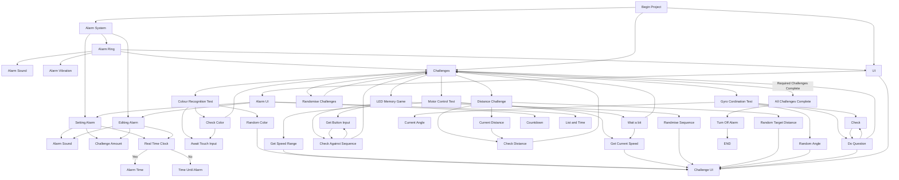

```mermaid
flowchart TD

A[Begin Project]

  

A --> B

B[Alarm System]

B --> B1

B --> B2

  

B1[Setting Alarm]

B1 --> B11

B1 --> B12

B1 --> B15 --> |Yes| B13

B15 --> |No|B14

  

B11[Alarm Sound]

B12[Challenge Amount]

B13[Alarm Time]

B14[Time Until Alarm]

B15[Real Time Clock]

  

B2[Editing Alarm]

B2 --> B11

B2 --> B12

B2 --> B15

  

B --> B3

B3[Alarm Ring]

  

B3 --> B31

B3 --> B32

B3 --> C

B3 --> D

B31[Alarm Sound]

B32[Alarm Vibration]

  

A --> C

C[Challenges]

C --> C1

C --> C2

C --> C3

C --> C4

C --> C5

  

C1[Colour Recognition Test]

C1 --> C11

C1 --> C12

C1 --> C13

C13 --> C12

C13 --> C

C11[Random Color]

C11 --> D2

C12[Await Touch Input]

C13[Check Color]

  
  

C2[Motor Control Test]

C2 --> C21

C2 --> C22

C2 --> C23

C21[Get Speed Range]

C21 --> D2

C22[Get Current Speed]

C22 --> D2

C23[Wait a bit]

C23 --> C22

C23 --> C

  

C3[LED Memory Game]

C3 --> C31

C3 --> C32

C3 --> C33

C31[Randmise Sequence]

C31 --> D2

C32[Get Button Input]

C32 --> C33

C33[Check Against Sequence]

C33 --> C32

C33 --> C

  

C4[Distance Challenge]

C4 --> C41

C4 --> C42

C4 --> C43

C41[Random Target Distance]

C41 --> D2

C42[Current Distance]

C42 --> C43

C43[Check Distance]

C43 --> C

  

C5[Gyro Cordination Test]

C5 --> C51

C5 --> C52

C5 --> C53

C5 --> C54

C51[Random Angle]

C51 --> D2

C52[Current Angle]

C53[Check]

C53 --> C54

C54[Do Question]

C54 --> C53

C54 --> D2

C54 --> C

  

C6[Randomise Challenges]

C --> C6

C6 --> C

C --> |Required Challenges Complete| C7

C7[All Challenges Complete]

C7 --> Z[Turn Off Alarm]

Z --> END

  

A --> D

D[UI]

D --> D1

D --> D2

D1[Alarm UI]

D1 --> B1

D1 --> B2

D11[Countdown]

D1 --> D11

D12[List and Time]

D1 --> D12

D2[Challenge UI]
```
\